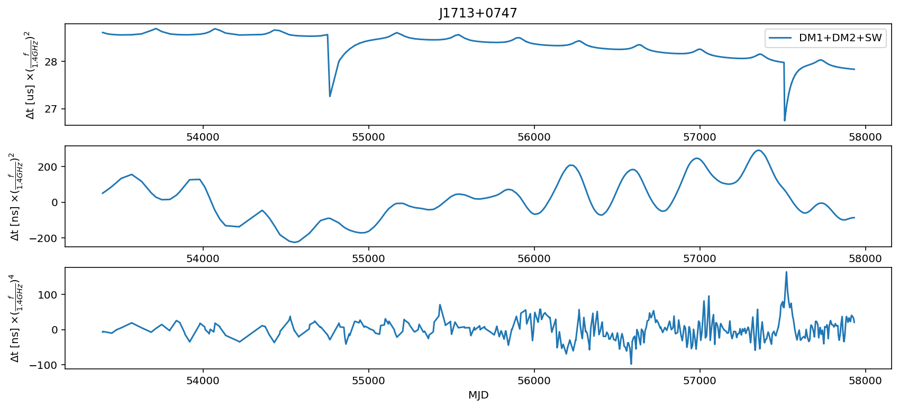
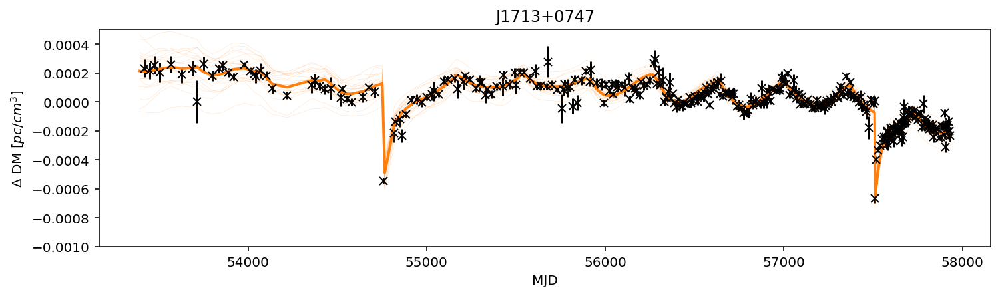
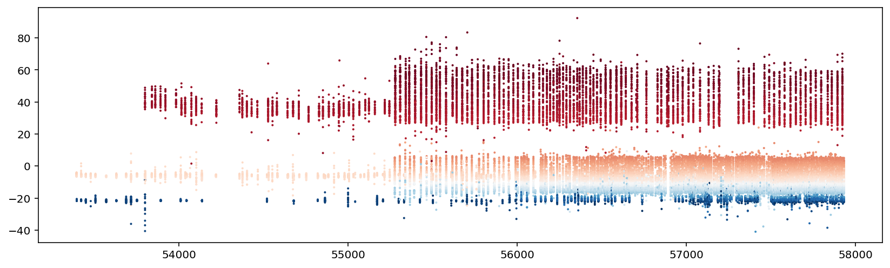
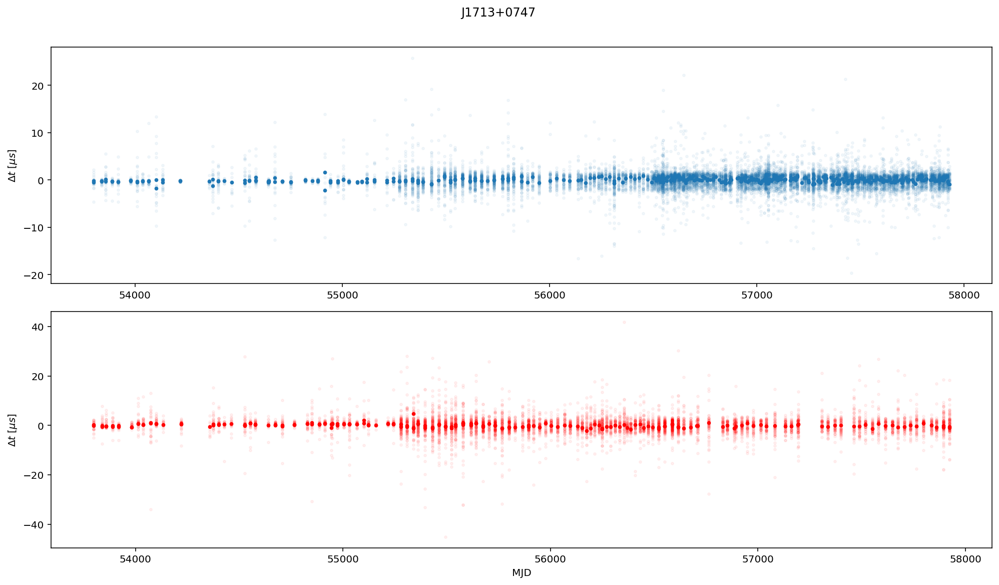
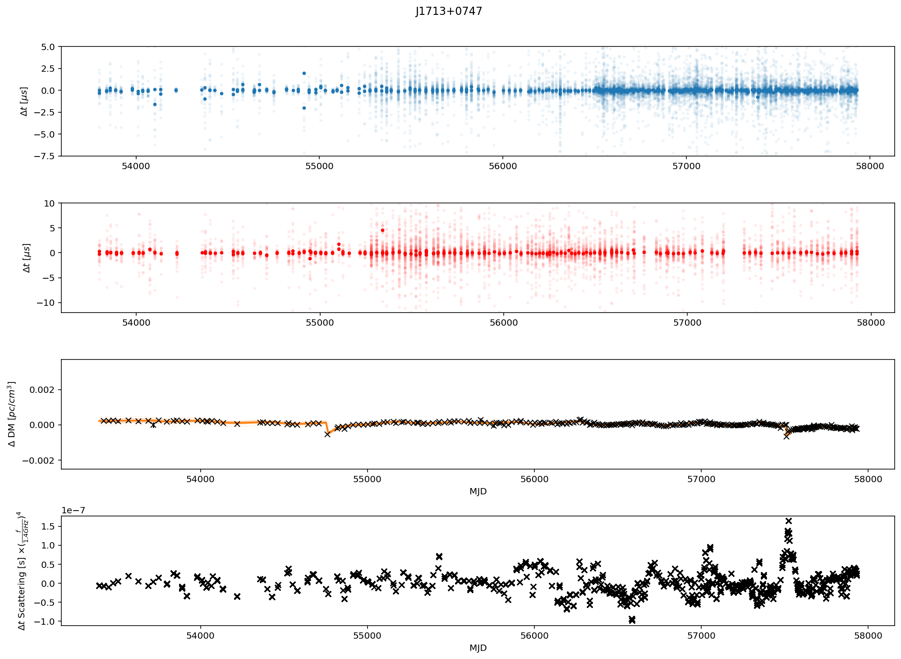

Tutorial #5 Visualizing Gaussian Process Realizations
=====================================================

The purpose of thise notebook is to look at the output from the noise
analysis and try to understand various aspects of what the model
selection and data are telling us.

.. code:: ipython3

    import matplotlib.pyplot as plt
    %config InlineBackend.figure_format = 'retina'
    %matplotlib inline
    import numpy as np
    import json, pickle, copy

.. code:: ipython3

    import la_forge.diagnostics as dg
    import la_forge.core as co
    from la_forge.rednoise import plot_rednoise_spectrum, plot_free_spec
    from la_forge.utils import epoch_ave_resid

Load Chains
~~~~~~~~~~~

You’ll want to point to the chains for the pulsar you wish to
investigate.

.. code:: ipython3

    psrname = 'J1713+0747'
    chaindir = '/Users/hazboun/software_development/la_forge/tests/data/chains/adv_noise_J1713+0747/'

Here we load up a set of chains from an
``enterprise.hypermodel.HyperModel`` analysis.

.. code:: ipython3

    cH=co.HyperModelCore(label='PSR {}, DM Model Selection',
                         chaindir=chaindir)

The ``HyperModelCore.model_core`` method returns only the samples, and
paranmeters, for one particular model.

.. code:: ipython3

    c0=cH.model_core(0)

Gaussian Process Realizations
=============================

Most of the advanced noise models that we are unleashing on ur various
pulsars are various iterations of Gaussian processes. These are meant to
model stochastic processes in data and while there are often functions
that are used to describe them, they are inherently realization
dependent. In order to get a feeling for how well the GPs are fitting
the data we use ``enterprise`` to make realizations of the GPs.

We start by importing a few functions, retrieving the pulsar and making
the PTA object.

.. code:: ipython3

    from enterprise_extensions.models import model_singlepsr_noise

.. code:: ipython3

    from la_forge.gp import Signal_Reconstruction as gp

.. code:: ipython3

    filepath = '/Users/hazboun/nanograv_detection/12p5yr/noise_model_selection/'
    filepath += '{0}_ng12p5yr_v3_nodmx_ePSR.pkl'.format(psrname)

.. code:: ipython3

    with open(filepath,'rb') as fin:
        psr=pickle.load(fin)

    with open(chaindir+'/model_kwargs.json' , 'r') as fin:
        model_kwargs=json.load(fin)

You shouldn’t need this next cell, but there are some of the original
model_kwarg dictionaries with spurious entries that need to be deleted.
If you get an error when calling ``model_singlepsr_noise`` and it
matches one of the these kwargs, try running this cell to delete them.

.. code:: ipython3

    pta = model_singlepsr_noise(psr, **model_kwargs['0'])

.. code:: ipython3

    len(pta.param_names), len(c0.params[:-4])

.. parsed-literal::

    (41, 41)

The ``Signal_Reconstruction`` class take an ``enterprise.pulsar.Pulsar``
object, an ``enterprise.signal_base.PTA`` object and a
``la_forge.core.Core`` object as inputs. (One can alternatively use a
chain array and burn value for the latter.)

.. code:: ipython3

    sr=gp(psr, pta, core=c0)

The ``gp_types`` atribute will tell you which Gaussian process signals
are available in this ``PTA``. Additionally there are a number of other
options one can use for the ``gp_type`` flag that goes into a signal
reconstruction. These include ``['achromatic_rn','DM','FD','all']``.
Also any of the timing parameter perturbations can also be called.

.. code:: ipython3

    sr.gp_types

.. parsed-literal::

    ['linear_timing_model', 'red_noise', 'dm_gp', 'chrom_gp']

Every pulsar has a list of the timing parameters that are fit with the
linearized timing model. These are also modeled as Gaussian process and
can be retrieved with the same functions.

.. code:: ipython3

    psr.fitpars

.. parsed-literal::

    ['Offset',
     'ELONG',
     'ELAT',
     'F0',
     'F1',
     'DM',
     'DM1',
     'DM2',
     'PMELONG',
     'PMELAT',
     'PX',
     'PB',
     'T0',
     'A1',
     'OM',
     'ECC',
     'M2',
     'FD1',
     'FD2',
     'FD3',
     'FD4',
     'FD5',
     'KOM',
     'KIN',
     'JUMP1',
     'JUMP2',
     'JUMP3']

.. code:: ipython3

    # parameter indices to pull from chain. Change `size` flag for more or less.
    # first one picks the "most likely values"
    idxs = np.argsort(c0.get_param('lnpost',to_burn=False))[::-1][:20]

    # this one just picks random values. Should be broadly the same as above if well converged
    # idxs = np.random.randint(sr.burn, sr.chain.shape[0],size=100)

The ``reconstruct_signal`` method
~~~~~~~~~~~~~~~~~~~~~~~~~~~~~~~~~

There are few useful options for regaining GPs using this method. Here
is the docstring:

::

   Parameters
   ----------
   gp_type : str, {'achrom_rn','gw','DM','none','all',timing parameters}
       Type of gaussian process signal to be reconstructed. In addition
       any GP in `psr.fitpars` or `Signal_Reconstruction.gp_types` may be
       called.
       ['achrom_rn','red_noise'] : Return the achromatic red noise.
       ['DM'] : Return the timing-model parts of dispersion model.
       [timing parameters] : Any of the timing parameters from the linear
           timing model. A list is available as `psr.fitpars`.
       ['timing'] : Return the entire timing model.
       ['gw'] : Gravitational wave signal. Works with common process in
           full PTAs.
       ['none'] : Returns no Gaussian processes. Meant to be used for
           returning deterministic signal.
       ['all'] : Returns all Gaussian processes.

   det_signal : bool
       Whether to include the deterministic signals in the reconstruction.

   mlv : bool
       Whether to use the maximum likelihood value for the reconstruction.

   idx : int, optional
       Index of the chain array to use.

In particular you can choose which GP signals to return. To return a
single gp choose from the list ``sr.gp_types``. If you want the
dispersion measure elements of the DM model you can use ``'DM'``. This
returns either the DMX GP or the DM1 and DM2 GPs.

To get all of the deterministic signals, but no GP use
``reconstruct_signal(gp_type='none',det_signal=True, ...)``.

The next cell gives the timing model components of the dispersion model
+ any deterministic models (DM, CW, …). The only determinsitic model
this pulsar has is the solar wind, but if you add DM dips or something
this is the flag to use. You get all of them at the same time. One can
construct these signals separately but it would take different code.

.. code:: ipython3

    DM = np.array([sr.reconstruct_signal(gp_type='DM',det_signal=True, idx=idx)[psrname]
                   for idx in idxs])

The next three cells return realizations of the DM GP and the Chromatic
GP.

.. code:: ipython3

    dm_gp = np.array([sr.reconstruct_signal(gp_type='dm_gp', idx=idx)[psrname]
                      for idx in idxs])

.. code:: ipython3

    chrom_gp = np.array([sr.reconstruct_signal(gp_type='chrom_gp', idx=idx)[psrname]
                        for idx in idxs])

.. code:: ipython3

    mn_DM = np.mean(DM,axis=0)
    mn_dmgp = np.mean(dm_gp,axis=0)
    mn_chrom_gp = np.mean(chrom_gp,axis=0)

.. code:: ipython3

    fig = plt.figure(figsize=[14,6])

    ####### First Plot ########
    fig.add_subplot(311)
    plt.plot(psr.toas/(24*3600),mn_DM*(psr.freqs/1400)**2*1e6,label='DM1+DM2+SW')
    plt.legend()
    plt.ylabel(r'$\Delta$t [us] $\times (\frac{f}{1.4 GHz})^2$')
    plt.title(psrname)

    ####### Second Plot ########
    fig.add_subplot(312)
    plt.plot(psr.toas/(24*3600),mn_dmgp*(psr.freqs/1400)**2*1e9,label='DM GP 1')
    plt.ylabel(r'$\Delta$t [ns] $\times (\frac{f}{1.4 GHz})^2$')

    ####### Third Plot ########
    fig.add_subplot(313)
    plt.plot(psr.toas/(24*3600),mn_chrom_gp*(psr.freqs/1400)**4*1e9,label='Chrom GP')
    plt.ylabel(r'$\Delta$t [ns] $\times (\frac{f}{1.4 GHz})^4$')
    plt.xlabel('MJD')
    plt.show()

Plot DMX
--------

Use the DMX values from the data release as a comparison of how well the
DM GP models are matching the changes in the dispersion measure.

.. code:: ipython3

    #Load DMX values
    dtypes = {'names': ('DMXEP', 'DMX_value', 'DMX_var_err',
                        'DMXR1', 'DMXR2', 'DMXF1',
                        'DMXF2', 'DMX_bin'),
              'formats': ('f4','f4','f4','f4','f4','f4','f4','U6')}
    dmx = np.loadtxt('/Users/hazboun/nanograv_detection/12p5yr/noise_model_selection/dmx/{0}_NANOGrav_12yv3.dmx'.format(psrname),
                     skiprows=4,
                     dtype=dtypes)

.. code:: ipython3

    # Convert signals into units of DM [pc/cm^3]
    dm_units = (dm_gp  + DM)*psr.freqs[np.newaxis,:]**2*2.41e-4
    dm_mean = (mn_DM + mn_dmgp )*psr.freqs**2*2.41e-4

.. code:: ipython3

    plt.figure(figsize=[12,3])
    for dm in dm_units:
        plt.plot(psr.toas/(24*3600),dm-dm.mean(),linewidth=0.2,alpha=0.3,color='C1')

    plt.plot(psr.toas/(24*3600),dm_mean-dm_mean.mean(),linewidth=2,color='C1')
    plt.errorbar(x=dmx['DMXEP'],
                 y=dmx['DMX_value']-dmx['DMX_value'].mean(),
                 yerr=dmx['DMX_var_err'],
                 marker='x',color='k',linestyle='none')

    plt.ylim(-0.0010,0.0005)
    plt.xlabel('MJD')
    plt.ylabel(r'$\Delta$ DM [$pc/cm^3$]')
    plt.title(psrname)
    plt.show()

Looking at Residuals
--------------------

Uncorrected residuals will look really bad since we have stripped all of
the DMX parameters and DM1/DM2 are set to zero initially.

.. code:: ipython3

    sec_to_day = 24*3600
    plt.figure(figsize=[14,4])
    plt.scatter(x=psr.toas/sec_to_day,
                y=(psr.residuals)*1e6,
                s=1,
                c=psr.freqs,cmap='RdBu')
    # plt.xlim(57000,58000)
    plt.show()

The GPs are natively returned as delays in seconds so we can subtract
them from the residuals to see what residuals ``Enterprise`` is actually
calculating during the analysis. The following function calculates the
epoch averaged TOAs after subtracting the given ``correction`` GPs.

.. code:: ipython3

    resids,msks=epoch_ave_resid(psr, correction= mn_DM + mn_dmgp + mn_chrom_gp) #This is all the chromatic GPs, DM1/DM2 + DMGP + ChromGP

This shows the two masks created for the different receivers. This
allows us to plot by frequency.

.. code:: ipython3

    masks = list(msks.keys())
    masks

.. parsed-literal::

    ['Rcvr_800', 'Rcvr1_2', 'L-wide', 'S-wide']

.. code:: ipython3

    all_chrgp = mn_DM + mn_dmgp + mn_chrom_gp

.. code:: ipython3

    sec_to_day = 24*3600
    fig=plt.figure(figsize=[14,8])

    #--------- 1st Plot -------------#
    fig.add_subplot(211)
    high_rec = 'Rcvr1_2'

    plt.scatter(x=resids[high_rec][:,0]/sec_to_day,
                y=resids[high_rec][:,1]*1e6-np.mean(resids[high_rec][:,1]*1e6),
                s=8,c='C0')
    plt.scatter(x=psr.toas[msks[high_rec]]/sec_to_day,
                y=((psr.residuals-all_chrgp)[msks[high_rec]]-(psr.residuals-all_chrgp)[msks[high_rec]].mean())*1e6,
                s=6,
                c='C0',alpha=0.05)
    plt.ylabel(r'$\Delta t$ [$\mu s$]')

    #--------- 2nd Plot -------------#
    fig.add_subplot(212)
    low_rec = 'Rcvr_800'
    plt.scatter(x=resids[low_rec][:,0]/sec_to_day,
                y=resids[low_rec][:,1]*1e6-np.mean(resids[low_rec][:,1]*1e6),
                s=8, c='red')
    plt.scatter(x=psr.toas[msks[low_rec]]/sec_to_day,
                y=((psr.residuals-all_chrgp)[msks[low_rec]]-(psr.residuals-all_chrgp)[msks[low_rec]].mean())*1e6,
                s=6,
                c='red',alpha=0.05)#psr.freqs,cmap='RdBu')

    plt.ylabel(r'$\Delta t$ [$\mu s$]')
    plt.xlabel('MJD')
    fig.suptitle(psrname,y=1.01)
    fig.tight_layout()
    plt.show()

Here we just plot the residuals along with the scattering GP to see if
there is interesting that is missed by the current modeling.

.. code:: ipython3

    everything = np.array([sr.reconstruct_signal(gp_type='all',det_signal=True, idx=idx)[psrname] for idx in idxs])

.. code:: ipython3

    mn_all = np.mean(everything, axis=0)

.. code:: ipython3

    resids2,msks=epoch_ave_resid(psr, correction= mn_all) #This is all te chromatic GPs, DM1/DM2 + DMGP + ChromGP

.. code:: ipython3

    sec_to_day = 24*3600
    fig=plt.figure(figsize=[14,10])
    fig.add_subplot(411)
    plt.scatter(x=resids2['Rcvr1_2'][:,0]/sec_to_day,
                y=resids2['Rcvr1_2'][:,1]*1e6,
                s=8,c='C0')
    plt.scatter(x=psr.toas[psr.flags['fe']=='Rcvr1_2']/sec_to_day,
                y=(psr.residuals-mn_all)[psr.flags['fe']=='Rcvr1_2']*1e6,
                s=6,
                c='C0',alpha=0.05)
    plt.ylim(-7.5,5)
    plt.ylabel(r'$\Delta t$ [$\mu s$]')

    fig.add_subplot(412)

    plt.scatter(x=resids2['Rcvr_800'][:,0]/sec_to_day,
                y=resids2['Rcvr_800'][:,1]*1e6,
                s=8,c='red')
    plt.scatter(x=psr.toas[psr.flags['fe']=='Rcvr_800']/sec_to_day,
                y=(psr.residuals-mn_all)[psr.flags['fe']=='Rcvr_800']*1e6,
                s=6,
                c='red',alpha=0.05)
    plt.ylim(-12,10)

    plt.ylabel(r'$\Delta t$ [$\mu s$]')

    fig.add_subplot(413)

    for dm in dm_units:
        plt.plot(psr.toas/(24*3600),dm-dm.mean(),linewidth=0.2,alpha=0.3,color='C1')

    plt.plot(psr.toas/(24*3600),dm_mean-dm_mean.mean(),linewidth=2,color='C1')
    plt.errorbar(x=dmx['DMXEP'],
                 y=dmx['DMX_value']-dmx['DMX_value'].mean(),
                 yerr=dmx['DMX_var_err'],
                 marker='x',color='k',linestyle='none')

    plt.ylim(-0.0025,0.0037)
    plt.xlabel('MJD')
    plt.ylabel(r'$\Delta$ DM [$pc/cm^3$]')

    fig.add_subplot(414)
    plt.plot(psr.toas/sec_to_day, mn_chrom_gp*(psr.freqs/1400)**4,'x',color='k')
    plt.ylabel(r'$\Delta t$ Scattering [s] $\times (\frac{f}{1.4GHz})^4$')
    plt.xlabel('MJD')

    fig.suptitle(psrname,y=1.01)
    fig.tight_layout(pad=1.01)
    plt.show()

