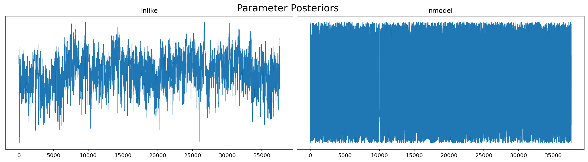
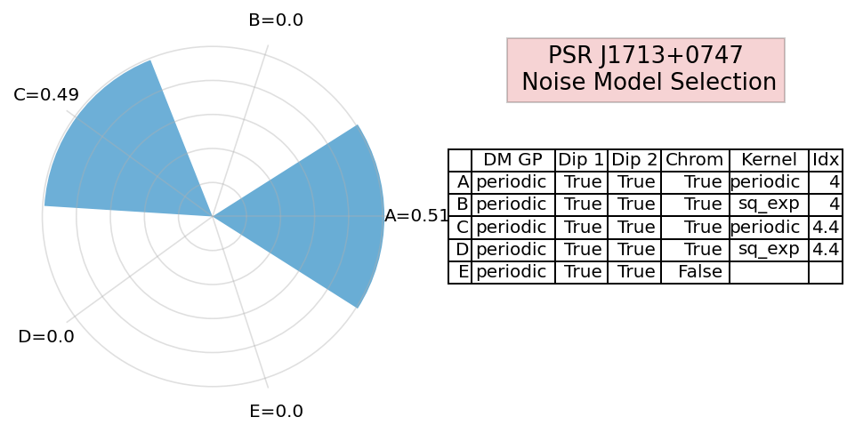
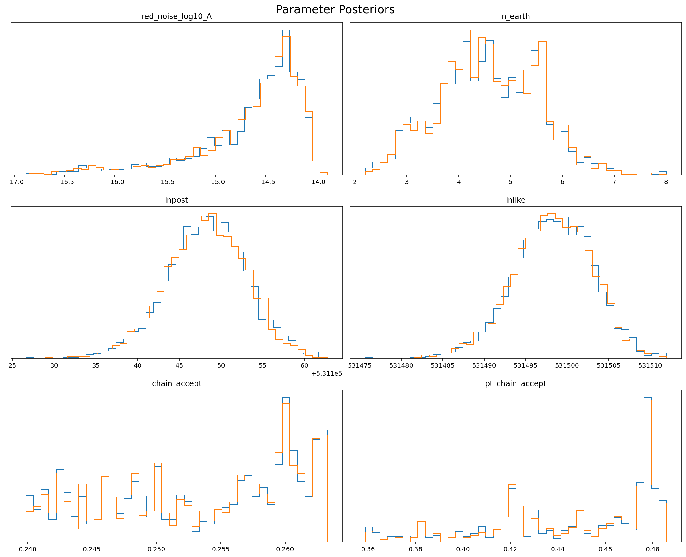

Tutorial #4 HyperModel Cores
============================

.. code:: ipython3

    import matplotlib.pyplot as plt
    %config InlineBackend.figure_format = 'retina'
    %matplotlib inline
    import numpy as np
    
    import json, pickle, copy

.. code:: ipython3

    import la_forge.diagnostics as dg
    import la_forge.core as co
    from la_forge.rednoise import plot_rednoise_spectrum, plot_free_spec
    from la_forge.utils import epoch_ave_resid

Loading Chains
--------------

.. code:: ipython3

    psrname = 'J1713+0747'
    chaindir = '/Users/hazboun/software_development/la_forge/tests/data/chains/adv_noise_J1713+0747/'

Us the ``core.HyperModelCore`` to load up the chains from an
``enterprise_extensions.hypermodel.HyperModel`` analysis. The code
automatically looks for a dictionary containing the parameters in each
model at ``'./model_params.json'``, but you can also provide one with a
keyword argument.

.. code:: ipython3

    cH=co.HyperModelCore(label=f'PSR {psrname}, DM Model Selection',
                         chaindir=chaindir)

The ``HyperModelCore`` has most of the same atrributes in the base
``Core`` class that are useful for looking at the chains.

.. code:: ipython3

    len(cH.param_dict.keys())

.. parsed-literal::

    5

Here we return the model with the largest number of samples.

.. code:: ipython3

    vals,bins=np.histogram(cH.get_param('nmodel'),
                           bins=[-0.5+ii for ii in range(len(cH.param_dict.keys()))])
    np.argmax(vals)

.. parsed-literal::

    0

.. code:: ipython3

    cH.set_burn(3000)
    dg.plot_chains(cH,hist=False,pars=['lnlike','nmodel'],ncols=2)

.. code:: ipython3

    def odds_ratio(nmodel,models=[0,1]):
        top = np.logical_and(nmodel>models[1]-0.5,nmodel<models[1]+0.5)
        bottom = np.logical_and(nmodel>models[0]-0.5,nmodel<models[0]+0.5)
        return np.sum(top)/np.sum(bottom)

.. code:: ipython3

    odds_ratio(cH('nmodel'),models=[0,2])

.. parsed-literal::

    0.9796767230032117

Noise Flower Plots
~~~~~~~~~~~~~~~~~~

One useful figure we look at for model selection anlayses is a radial
histogram that plots the time spent in each of the possible models. We
call these “noise flowers”.

Running advanced noise analysis tools leads to a set of labels being
saved for the models being analyzed in a given chain directory under
``'model_labels.json'``. This is a list of labels that should help us
keep track of the various models being analyzed. If these are not
descriptive enough, feel free to edit the nested list.

One can construct a list of your choosing as well.

.. code:: ipython3

    with open(chaindir+'/model_labels.json' , 'r') as fin:
        model_labels= json.load(fin)
    
    model_labels

.. parsed-literal::

    [['A', 'periodic', True, True, True, 'periodic', 4],
     ['B', 'periodic', True, True, True, 'sq_exp', 4],
     ['C', 'periodic', True, True, True, 'periodic', 4.4],
     ['D', 'periodic', True, True, True, 'sq_exp', 4.4],
     ['E', 'periodic', True, True, False, None, None]]

There is a ``noise_flower`` function in ``la_forge.diagnostics`` that
takes as input a ``HyperModelCore``, along with various options, in
order to fill out the table with useful information about the models
being analyzed.

.. code:: ipython3

    dg.noise_flower(cH, 
                    colLabels=['', 'DM GP','Dip 1','Dip 2','Chrom', 'Kernel','Idx'],
                    cellText=model_labels,
                    colWidths=[0.06,0.22,0.14,0.14,0.18,0.21,0.09])

Single model ``core``\ s
~~~~~~~~~~~~~~~~~~~~~~~~

A ``core.HyperModelCore`` object has a method to return **only** the
samples from a particular model.

The individual cores are pulled out using the ``model_core`` method and
an integer that gives which model you’d like returned.

.. code:: ipython3

    c0=cH.model_core(0)
    c2=cH.model_core(2)

These cores are now individual core instances that can be saved as
individual ``HDF5`` files.

.. code:: ipython3

    type(c0)

.. parsed-literal::

    la_forge.core.Core

.. code:: ipython3

    dg.plot_chains([c0,c2],pars=c0.params[-6:],ncols=2)

