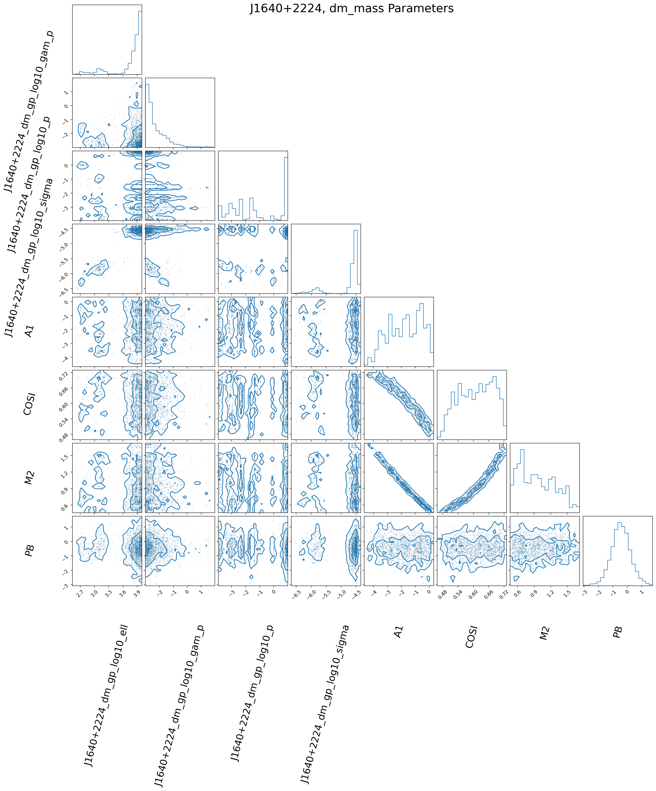
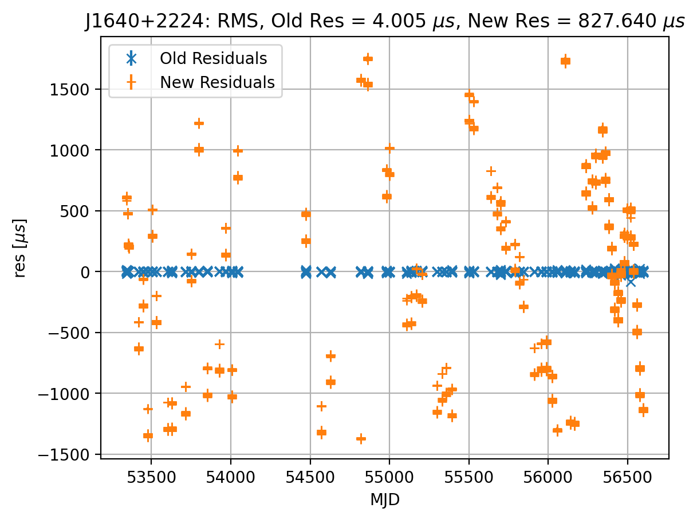
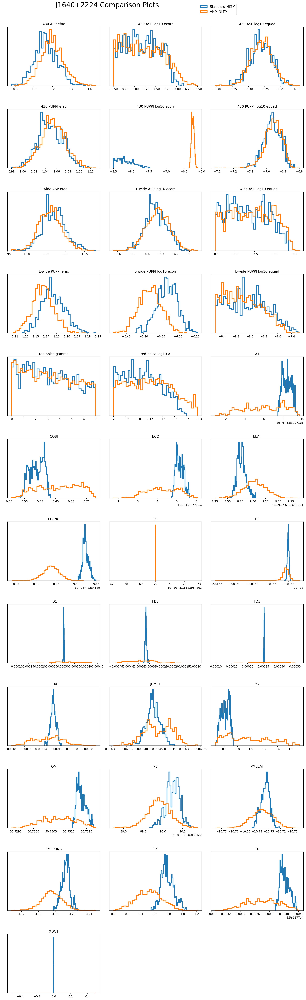
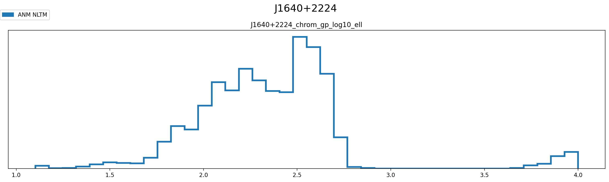
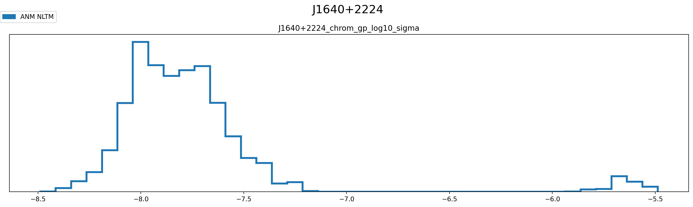
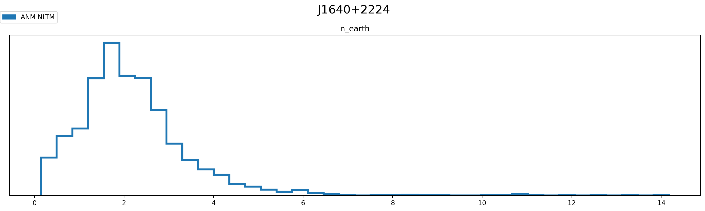
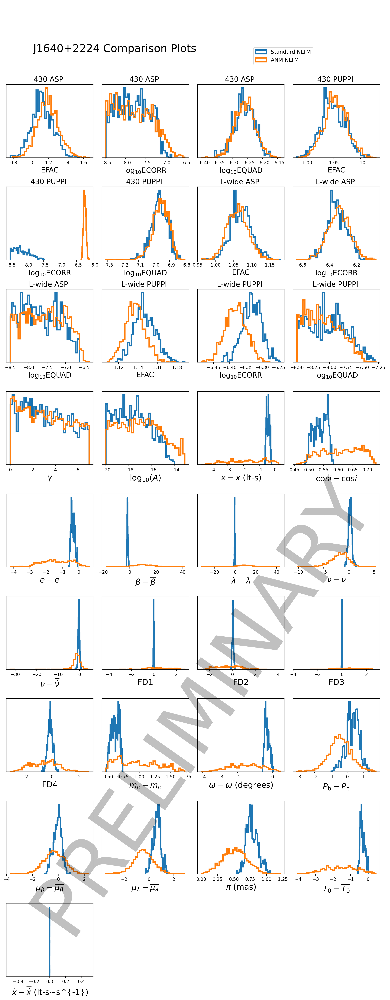
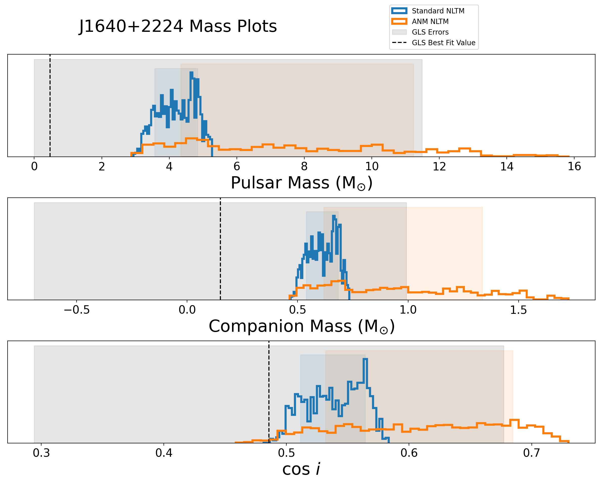

Tutorial #6 Visualizing TimingModel Cores
=========================================

This tutorial is to guide you through visualizing and analyzing results
from a single pulsar, non-linear timing run from ``enterprise``.

.. code:: ipython3

    import os
    import sys
    import warnings
    import numpy as np
    import matplotlib.pyplot as plt
    
    warnings.filterwarnings('ignore')
    
    %load_ext autoreload
    %autoreload 2
    %config InlineBackend.figure_format = 'retina'
    %matplotlib inline

.. code:: ipython3

    import enterprise
    from enterprise.pulsar import Pulsar
    
    import la_forge
    from la_forge import utils
    from la_forge.core import TimingCore
    import la_forge.diagnostics as dg
    import la_forge.timing as tm

.. code:: ipython3

    psr_name = "J1640+2224"
    
    datadir = ('/').join(la_forge.__path__[0].split('/')[:-1])
    parfile = f'{datadir}/tests/data/{psr_name}_ng9yr_dmx_DE421.par'
    timfile = f'{datadir}/tests/data/{psr_name}_ng9yr_dmx_DE421.tim'
    
    #Core Locations for a standard non-linear timing (NLTM) core and one with advanced noise modeling (ANM)
    std_core_loc = f'{datadir}/tests/data/chains/nonlinear_timing/{psr_name}_std_noise'
    anm_core_loc = f'{datadir}/tests/data/chains/nonlinear_timing/{psr_name}_adv_noise'

Load the Pulsar
---------------

Make sure the ephemeris is the same as in the parfile and you have to
retain the t2pulsar object. If you want to use ``PINT`` that is also
cool, just change the final two kwargs to
``drop_pintpsr=False, timing_package="pint"``

.. code:: ipython3

    psr = Pulsar(parfile,timfile,ephem='DE421',clk=None,drop_t2pulsar=False,timing_package="tempo2",)

Load TimingCores
----------------

Don’t forget to include the location of the original timing parameters
that you should have saved when initializing the pulsar before sampling
with ``enterprise``.

.. code:: ipython3

    burn=0.25
    std_core = TimingCore(label='Standard NLTM',
                          chaindir=std_core_loc,
                          tm_pars_path=std_core_loc+'/orig_timing_pars.pkl',
                          burn=burn)
    
    anm_core = TimingCore(label='ANM NLTM',
                          chaindir=anm_core_loc,
                          tm_pars_path=anm_core_loc+'/orig_timing_pars.pkl',
                          burn=burn)

Check Convergence of Chains
---------------------------

This function checks the autocorrelation of the chains of each parameter
and returns the worst value (longest autocorrelation length), which then
can be used to calculate the effective number of samples you have in
your worst parameter.

It also uses the `Gelman-Rubin split R-hat
statistic <https://arxiv.org/pdf/1903.08008.pdf>`__ to also check each
parameter for proper convergence.

These chains are not very well converged!

.. code:: ipython3

    dg.check_convergence([std_core,anm_core])

.. parsed-literal::

    -------------------------------
    core: Standard NLTM
    	 lnpost: 120050.431693, lnlike: 120989.384749
    	 Can't run Grubin test
    Watch Out! J1640+2224_430_PUPPI_efac
    Watch Out! J1640+2224_430_PUPPI_log10_equad
    Watch Out! J1640+2224_timing_model_A1
    Watch Out! J1640+2224_timing_model_COSI
    Watch Out! J1640+2224_timing_model_DMX_0001
    Watch Out! J1640+2224_timing_model_DMX_0002
    Watch Out! J1640+2224_timing_model_DMX_0003
    Watch Out! J1640+2224_timing_model_DMX_0004
    Watch Out! J1640+2224_timing_model_DMX_0005
    Watch Out! J1640+2224_timing_model_DMX_0006
    Watch Out! J1640+2224_timing_model_DMX_0007
    Watch Out! J1640+2224_timing_model_DMX_0008
    Watch Out! J1640+2224_timing_model_DMX_0009
    Watch Out! J1640+2224_timing_model_DMX_0010
    Watch Out! J1640+2224_timing_model_DMX_0011
    Watch Out! J1640+2224_timing_model_DMX_0012
    Watch Out! J1640+2224_timing_model_DMX_0013
    Watch Out! J1640+2224_timing_model_DMX_0014
    Watch Out! J1640+2224_timing_model_DMX_0015
    Watch Out! J1640+2224_timing_model_DMX_0016
    Watch Out! J1640+2224_timing_model_DMX_0017
    Watch Out! J1640+2224_timing_model_DMX_0018
    Watch Out! J1640+2224_timing_model_DMX_0019
    Watch Out! J1640+2224_timing_model_DMX_0020
    Watch Out! J1640+2224_timing_model_DMX_0021
    Watch Out! J1640+2224_timing_model_DMX_0022
    Watch Out! J1640+2224_timing_model_DMX_0023
    Watch Out! J1640+2224_timing_model_DMX_0024
    Watch Out! J1640+2224_timing_model_DMX_0025
    Watch Out! J1640+2224_timing_model_DMX_0026
    Watch Out! J1640+2224_timing_model_DMX_0027
    Watch Out! J1640+2224_timing_model_DMX_0028
    Watch Out! J1640+2224_timing_model_DMX_0029
    Watch Out! J1640+2224_timing_model_DMX_0030
    Watch Out! J1640+2224_timing_model_DMX_0031
    Watch Out! J1640+2224_timing_model_DMX_0032
    Watch Out! J1640+2224_timing_model_DMX_0033
    Watch Out! J1640+2224_timing_model_DMX_0034
    Watch Out! J1640+2224_timing_model_DMX_0035
    Watch Out! J1640+2224_timing_model_DMX_0036
    Watch Out! J1640+2224_timing_model_DMX_0037
    Watch Out! J1640+2224_timing_model_DMX_0038
    Watch Out! J1640+2224_timing_model_DMX_0039
    Watch Out! J1640+2224_timing_model_DMX_0040
    Watch Out! J1640+2224_timing_model_DMX_0041
    Watch Out! J1640+2224_timing_model_DMX_0042
    Watch Out! J1640+2224_timing_model_DMX_0043
    Watch Out! J1640+2224_timing_model_DMX_0044
    Watch Out! J1640+2224_timing_model_DMX_0047
    Watch Out! J1640+2224_timing_model_DMX_0048
    Watch Out! J1640+2224_timing_model_DMX_0049
    Watch Out! J1640+2224_timing_model_DMX_0050
    Watch Out! J1640+2224_timing_model_DMX_0051
    Watch Out! J1640+2224_timing_model_DMX_0052
    Watch Out! J1640+2224_timing_model_DMX_0055
    Watch Out! J1640+2224_timing_model_DMX_0056
    Watch Out! J1640+2224_timing_model_DMX_0058
    Watch Out! J1640+2224_timing_model_DMX_0059
    Watch Out! J1640+2224_timing_model_DMX_0060
    Watch Out! J1640+2224_timing_model_DMX_0061
    Watch Out! J1640+2224_timing_model_DMX_0062
    Watch Out! J1640+2224_timing_model_DMX_0063
    Watch Out! J1640+2224_timing_model_DMX_0064
    Watch Out! J1640+2224_timing_model_DMX_0066
    Watch Out! J1640+2224_timing_model_DMX_0067
    Watch Out! J1640+2224_timing_model_DMX_0068
    Watch Out! J1640+2224_timing_model_DMX_0069
    Watch Out! J1640+2224_timing_model_DMX_0070
    Watch Out! J1640+2224_timing_model_DMX_0071
    Watch Out! J1640+2224_timing_model_DMX_0072
    Watch Out! J1640+2224_timing_model_DMX_0073
    Watch Out! J1640+2224_timing_model_DMX_0074
    Watch Out! J1640+2224_timing_model_DMX_0075
    Watch Out! J1640+2224_timing_model_DMX_0077
    Watch Out! J1640+2224_timing_model_DMX_0079
    Watch Out! J1640+2224_timing_model_DMX_0080
    Watch Out! J1640+2224_timing_model_DMX_0081
    Watch Out! J1640+2224_timing_model_DMX_0082
    Watch Out! J1640+2224_timing_model_DMX_0083
    Watch Out! J1640+2224_timing_model_DMX_0084
    Watch Out! J1640+2224_timing_model_DMX_0085
    Watch Out! J1640+2224_timing_model_DMX_0087
    Watch Out! J1640+2224_timing_model_DMX_0088
    Watch Out! J1640+2224_timing_model_DMX_0089
    Watch Out! J1640+2224_timing_model_DMX_0090
    Watch Out! J1640+2224_timing_model_DMX_0092
    Watch Out! J1640+2224_timing_model_DMX_0093
    Watch Out! J1640+2224_timing_model_DMX_0094
    Watch Out! J1640+2224_timing_model_DMX_0095
    Watch Out! J1640+2224_timing_model_DMX_0097
    Watch Out! J1640+2224_timing_model_DMX_0098
    Watch Out! J1640+2224_timing_model_DMX_0099
    Watch Out! J1640+2224_timing_model_DMX_0100
    Watch Out! J1640+2224_timing_model_DMX_0101
    Watch Out! J1640+2224_timing_model_DMX_0102
    Watch Out! J1640+2224_timing_model_DMX_0103
    Watch Out! J1640+2224_timing_model_DMX_0104
    Watch Out! J1640+2224_timing_model_DMX_0105
    Watch Out! J1640+2224_timing_model_DMX_0106
    Watch Out! J1640+2224_timing_model_DMX_0107
    Watch Out! J1640+2224_timing_model_DMX_0108
    Watch Out! J1640+2224_timing_model_DMX_0109
    Watch Out! J1640+2224_timing_model_DMX_0110
    Watch Out! J1640+2224_timing_model_DMX_0111
    Watch Out! J1640+2224_timing_model_DMX_0112
    Watch Out! J1640+2224_timing_model_DMX_0113
    Watch Out! J1640+2224_timing_model_DMX_0114
    Watch Out! J1640+2224_timing_model_DMX_0115
    Watch Out! J1640+2224_timing_model_DMX_0116
    Watch Out! J1640+2224_timing_model_DMX_0117
    Watch Out! J1640+2224_timing_model_DMX_0118
    Watch Out! J1640+2224_timing_model_DMX_0119
    Watch Out! J1640+2224_timing_model_DMX_0120
    Watch Out! J1640+2224_timing_model_DMX_0122
    Watch Out! J1640+2224_timing_model_DMX_0123
    Watch Out! J1640+2224_timing_model_DMX_0124
    Watch Out! J1640+2224_timing_model_DMX_0125
    Watch Out! J1640+2224_timing_model_DMX_0127
    Watch Out! J1640+2224_timing_model_DMX_0128
    Watch Out! J1640+2224_timing_model_DMX_0129
    Watch Out! J1640+2224_timing_model_DMX_0130
    Watch Out! J1640+2224_timing_model_DMX_0132
    Watch Out! J1640+2224_timing_model_DMX_0133
    Watch Out! J1640+2224_timing_model_DMX_0134
    Watch Out! J1640+2224_timing_model_DMX_0135
    Watch Out! J1640+2224_timing_model_DMX_0136
    Watch Out! J1640+2224_timing_model_DMX_0137
    Watch Out! J1640+2224_timing_model_DMX_0138
    Watch Out! J1640+2224_timing_model_DMX_0139
    Watch Out! J1640+2224_timing_model_DMX_0140
    Watch Out! J1640+2224_timing_model_DMX_0141
    Watch Out! J1640+2224_timing_model_DMX_0142
    Watch Out! J1640+2224_timing_model_DMX_0143
    Watch Out! J1640+2224_timing_model_DMX_0144
    Watch Out! J1640+2224_timing_model_DMX_0145
    Watch Out! J1640+2224_timing_model_DMX_0146
    Watch Out! J1640+2224_timing_model_DMX_0147
    Watch Out! J1640+2224_timing_model_DMX_0148
    Watch Out! J1640+2224_timing_model_DMX_0149
    Watch Out! J1640+2224_timing_model_DMX_0150
    Watch Out! J1640+2224_timing_model_DMX_0152
    Watch Out! J1640+2224_timing_model_DMX_0153
    Watch Out! J1640+2224_timing_model_DMX_0154
    Watch Out! J1640+2224_timing_model_DMX_0155
    Watch Out! J1640+2224_timing_model_DMX_0156
    Watch Out! J1640+2224_timing_model_DMX_0157
    Watch Out! J1640+2224_timing_model_DMX_0159
    Watch Out! J1640+2224_timing_model_DMX_0160
    Watch Out! J1640+2224_timing_model_DMX_0161
    Watch Out! J1640+2224_timing_model_DMX_0162
    Watch Out! J1640+2224_timing_model_DMX_0163
    Watch Out! J1640+2224_timing_model_DMX_0164
    Watch Out! J1640+2224_timing_model_DMX_0165
    Watch Out! J1640+2224_timing_model_DMX_0166
    Watch Out! J1640+2224_timing_model_DMX_0167
    Watch Out! J1640+2224_timing_model_DMX_0168
    Watch Out! J1640+2224_timing_model_DMX_0170
    Watch Out! J1640+2224_timing_model_DMX_0171
    Watch Out! J1640+2224_timing_model_DMX_0172
    Watch Out! J1640+2224_timing_model_DMX_0173
    Watch Out! J1640+2224_timing_model_DMX_0174
    Watch Out! J1640+2224_timing_model_DMX_0176
    Watch Out! J1640+2224_timing_model_DMX_0177
    Watch Out! J1640+2224_timing_model_DMX_0178
    Watch Out! J1640+2224_timing_model_DMX_0179
    Watch Out! J1640+2224_timing_model_DMX_0180
    Watch Out! J1640+2224_timing_model_DMX_0181
    Watch Out! J1640+2224_timing_model_DMX_0182
    Watch Out! J1640+2224_timing_model_DMX_0183
    Watch Out! J1640+2224_timing_model_DMX_0185
    Watch Out! J1640+2224_timing_model_DMX_0186
    Watch Out! J1640+2224_timing_model_DMX_0187
    Watch Out! J1640+2224_timing_model_DMX_0188
    Watch Out! J1640+2224_timing_model_ECC
    Watch Out! J1640+2224_timing_model_ELAT
    Watch Out! J1640+2224_timing_model_ELONG
    Watch Out! J1640+2224_timing_model_F0
    Watch Out! J1640+2224_timing_model_F1
    Watch Out! J1640+2224_timing_model_M2
    Watch Out! J1640+2224_timing_model_OM
    Watch Out! J1640+2224_timing_model_PB
    Watch Out! J1640+2224_timing_model_PMELAT
    Watch Out! J1640+2224_timing_model_PX
    Watch Out! J1640+2224_timing_model_T0
    Watch Out! J1640+2224_timing_model_XDOT
    	 Max autocorrelation length: 899.5687689572227, Effective sample size: 8.337328127447083
    
    -------------------------------
    core: ANM NLTM
    	 lnpost: 120632.710775, lnlike: 120663.635304
    	 Can't run Grubin test
    Watch Out! J1640+2224_dm_gp_log10_ell
    Watch Out! J1640+2224_dm_gp_log10_p
    Watch Out! J1640+2224_dm_gp_log10_sigma
    Watch Out! J1640+2224_timing_model_FD1
    Watch Out! J1640+2224_timing_model_FD2
    Watch Out! J1640+2224_timing_model_FD3
    Watch Out! J1640+2224_timing_model_FD4
    	 Max autocorrelation length: 2351.7231935929976, Effective sample size: 12.757028583012794
    

Investigating a Single Chain
----------------------------

In addition to the usual way of investigating a single core as shown in
Tutorial #2, we added a few special methods specific to usefulness with
analyzing the timing model posteriors and resulting parameters. 1.
Create a summary comparison of timing parameters to the original
parameters in the parfile. \* You can specify different parameters to
look at (especially if you don’t want all DMX parameters in there) by
chaining together the abbreviated names of the parameters. I.e. ‘all’,
or ‘kep’,‘mass’,‘gr’,‘spin’,‘pos’,‘noise’, ‘dm’, ‘chrom’, ‘dmx’, ‘fd’
all joined by underscores

.. code:: ipython3

    print(tm.summary_comparison(psr_name, std_core, selection="kep_pos"))

.. parsed-literal::

       Parameter                  Old Value       New Median Value  \
    0         A1               55.329720617      55.32971839107948   
    1       COSI      0.4857874000743535135     0.5406945544488284   
    2        ECC               0.0007972573  0.0007972513598406172   
    3       ELAT      0.7689661391921029106     0.7689661387741951   
    4      ELONG       4.258412990301330403      4.258412990223339   
    5         M2                   0.150233     0.6138985570998517   
    6         OM            50.731656477361      50.73133350091245   
    7         PB         175.46066190105114     175.46066190260123   
    8         PX                     0.7634     0.7722948798457538   
    9         T0           55661.7741583016      55661.77400085836   
    10      XDOT  1.1381999999999999771e-14         1.14461542e-14   
    
                        Difference                  Old Sigma  \
    0   -2.2259205185795605253e-06   4.915000000000000376e-06   
    1      0.054907154374474899286     0.19146885198497040605   
    2    -5.940159382829781999e-09  1.6499999999999998856e-08   
    3   -4.1790784792135673986e-10   2.609963154883317638e-10   
    4   -7.7991657403131409154e-11  2.4009039255791302003e-10   
    5       0.46366555709985174936      0.8419640000000000457   
    6   -0.00032297644855135837494  0.00096873911400000001486   
    7    1.5500910832688674645e-09  4.4712999999999996453e-09   
    8      0.008894879845753845497      0.2732999999999999874   
    9   -0.00015744324311484092505   0.0004721635999999999867   
    10    6.415419999999950106e-17   0.0007029999999999999574   
    
                     New Sigma Rounded Old Value Rounded Old Sigma  \
    0     5.35711777160941e-07         55.329721             5e-06   
    1     0.029021010504071465               0.5               0.2   
    2   2.2919461774425706e-09        0.00079726             2e-08   
    3    8.583556088126443e-11      0.7689661392             3e-10   
    4    8.973533027756275e-11      4.2584129903             2e-10   
    5      0.07322860143708387               0.2               0.8   
    6   0.00016727601836663553           50.7317             0.001   
    7   1.7348327219224302e-09     175.460661901             4e-09   
    8      0.10268747254371835               0.8               0.3   
    9    8.154512761393562e-05        55661.7742            0.0005   
    10   3.373994839999993e-16               0.0            0.0007   
    
       Rounded New Value Rounded New Sigma >1 sigma change? More Constrained?  
    0         55.3297184             5e-07            False              True  
    1               0.54              0.03            False              True  
    2        0.000797251             2e-09            False              True  
    3      0.76896613877             9e-11             True              True  
    4      4.25841299022             9e-11            False              True  
    5               0.61              0.07            False              True  
    6            50.7313            0.0002            False              True  
    7      175.460661903             2e-09            False              True  
    8                0.8               0.1            False              True  
    9          55661.774             8e-05            False              True  
    10          1.14e-14             3e-16            False              True  

2. A more tailored corner plot that allows for the ``selection``
   functionality.

.. code:: ipython3

    tm.corner_plots(psr_name, anm_core, selection="dm_mass",
                    truths=False, corner_label_kwargs={"rotation":75, "fontsize":20})

3. Examining changes in the residuals

The function uses either the mean, median, or maximum a posteriori of
each parameter’s posterior to calculate new residuals. Since our example
is not very converged, the timing model parameters have not settled to
their final values, meaning their residuals are pretty different from
those of the original parfile values.

.. code:: ipython3

    tm.residual_comparison(psr, std_core, use_mean_median_map="median")

.. parsed-literal::

    Offset not in psr pars
    OMDOT not in psr pars

Comparing Multiple Chains
-------------------------

Since the usual plotting in ``diagnostics`` is mainly used for a single
core, we expanded it in a new function to be able to plot only the
overlapping parameters between multiple chains.

.. code:: ipython3

    tm.plot_all_param_overlap(psr_name, [std_core, anm_core], fig_kwargs={"suptitleloc":(0.35, 1.02),
                                                                          "legendloc":(0.65, 0.985)})

To plot all the non-overlapping parameters, one would just use the
following function. It also supports ``selection`` and the ability to
display the truth values if assigned in ``par_sigma``, but since there
is perfect overlap in the timing model parameters in this case, we don’t
use ``par_sigma``.

.. code:: ipython3

    tm.plot_other_param_overlap(psr_name, [std_core, anm_core],
                                selection="chrom")

.. parsed-literal::

    

.. parsed-literal::

    

.. parsed-literal::

    

Fancy Plotting
~~~~~~~~~~~~~~

For making the labels and display a little nicer to compare multiple
cores, use ``fancy_plot_all_param_overlap``. As with the other two
comparison plotting functions, you can choose to display the timing
model parameters in their scaled versions (in terms of sigma, e.g. a
value of 1 is one parfile error away from the parfile value) or in their
non-scaled version with ``real_tm_pars``. This also supports
``selection``!

.. code:: ipython3

    tm.fancy_plot_all_param_overlap(psr_name,[std_core,anm_core], real_tm_pars=False, 
                                    fig_kwargs={"suptitleloc":(0.35, 0.915),
                                                "legendloc":(0.65, 0.935)})

Binary Pulsars
~~~~~~~~~~~~~~

For binary pulsars, it is often useful to plot the mass parameters.
Since the pulsar mass is derived using the mass function, this method
makes it fairly easy to use the companion mass and inclination angle of
the system to calculate the implied pulsar mass.

It is especially interesting to compare changes in results between
different models. In this case, we compare a version that uses Gaussian
processes to model the dispersion measure and a model with the usual
DMX.

This function has the ability to display the truth values if assigned in
``par_sigma``. In this case, we use the parfile values. It can also
display the confidence interval regions of each parameter, as well as
printing them out.

.. code:: ipython3

    tm.mass_plot(psr_name,[std_core, anm_core], par_sigma=std_core.tm_pars_orig,
                 conf_int=68.3, print_conf_int=True, show_legend=False,
                 fig_kwargs={"suptitleloc":(0.35,.95)})
    fig = plt.gcf()
    allaxes = fig.get_axes()
    allaxes[0].legend(loc=(.65,1.05))
    plt.show()

.. parsed-literal::

    Standard NLTM
    ----------------
    Pulsar Mass$~(\mathrm{M}_{\odot})$
    Median: 4.231845440393451
    Lower: 3.571048779316878
    Upper: 4.837561819398495
    Diff Lower: 0.6607966610765734
    Diff Upper: 0.6057163790050435
    Rounded Median: 4.2 or 4.2
    Rounded Lower: 0.7
    Rounded Upper: 0.6
    
    Companion Mass$~(\mathrm{M}_{\odot})$
    Median: 0.6138985570998517
    Lower: 0.5399712089193538
    Upper: 0.6842258810057296
    Diff Lower: 0.07392734818049795
    Diff Upper: 0.07032732390587781
    Rounded Median: 0.61 or 0.61
    Rounded Lower: 0.07
    Rounded Upper: 0.07
    
    $\mathrm{cos}~i$
    Median: 57.26906729865635
    Lower: 55.64806635697287
    Upper: 59.23087137818909
    Diff Lower: 1.6210009416834763
    Diff Upper: 1.961804079532748
    Rounded Median: 57.0 or 57.0
    Rounded Lower: 2.0
    Rounded Upper: 2.0
    
    ANM NLTM
    ----------------
    Pulsar Mass$~(\mathrm{M}_{\odot})$
    Median: 7.101033676816102
    Lower: 4.336358066066241
    Upper: 11.234330723551869
    Diff Lower: 2.764675610749861
    Diff Upper: 4.133297046735767
    Rounded Median: 7.0 or 7.0
    Rounded Lower: 3.0
    Rounded Upper: 4.0
    
    Companion Mass$~(\mathrm{M}_{\odot})$
    Median: 0.9180650874905036
    Lower: 0.6186547655051454
    Upper: 1.3362152567380348
    Diff Lower: 0.2994103219853582
    Diff Upper: 0.4181501692475311
    Rounded Median: 0.9 or 0.9
    Rounded Lower: 0.3
    Rounded Upper: 0.4
    
    $\mathrm{cos}~i$
    Median: 51.938063041295734
    Lower: 46.799423491249094
    Upper: 57.86208441108003
    Diff Lower: 5.138639550046645
    Diff Upper: 5.924021369784299
    Rounded Median: 52.0 or 52.0
    Rounded Lower: 5.0
    Rounded Upper: 6.0
    

Utility Functions
-----------------

To make it easier to setup an ``enterprise`` run with DM Gaussian
processes, we created a utility function to strip a parfile of its DMX
values in the way that the advanced noise modeling runs need when
initialized. The function saves the output in the folder the function is
run in with the default name of the parfile value given to it.

.. code:: ipython3

    os.listdir(f'{datadir}/tests/data/')

.. parsed-literal::

    ['J1640+2224_ng9yr_dmx_DE421.tim',
     'J1640+2224_ng9yr_dmx_DE421.par',
     'J1713+0747.pkl',
     'chains',
     'cores']

.. code:: ipython3

    utils.make_dmx_file(parfile)

.. code:: ipython3

    os.listdir(f'{datadir}/tests/data/')

.. parsed-literal::

    ['J1640+2224_ng9yr_dmx_DE421.tim',
     'J1640+2224_ng9yr_dmx_DE421.par',
     'J1713+0747.pkl',
     'J1640+2224_ng9yr_dmx_DE421.dmx',
     'chains',
     'cores']

