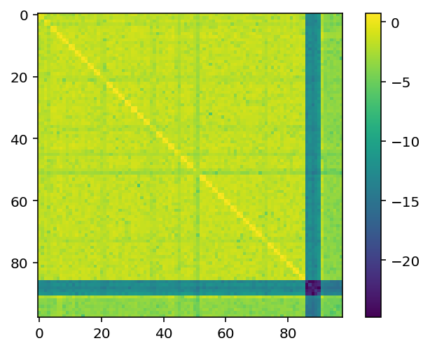

Tutorial #1 Basic Core Usage
============================

.. code:: ipython3

    import la_forge.core as co
    import matplotlib.pyplot as plt
    %matplotlib inline
    %config InlineBackend.figure_format = 'retina'
    import numpy as np
    import json

Loading a Chain Directory
-------------------------

.. code:: ipython3

    chaindir = '/Users/hazboun/software_development/la_forge/tests/data/chains/ng12p5yr_pint_be/'

.. code:: ipython3

    c0 = co.Core(chaindir=chaindir,
                 label='NG12.5-year Pint Bayes Ephem Tests')

.. code:: ipython3

    print('Number of parameters: \t',len(c0.params))
    print('Chain shape: \t\t',c0.chain.shape)
    print('Burn: \t\t\t' , c0.burn)

.. parsed-literal::

    Number of parameters: 	 102
    Chain shape: 		 (6500, 102)
    Burn: 			 1625

.. code:: ipython3

    c0.params[:10]

.. parsed-literal::

    ['B1855+09_red_noise_gamma',
     'B1855+09_red_noise_log10_A',
     'B1953+29_red_noise_gamma',
     'B1953+29_red_noise_log10_A',
     'J0023+0923_red_noise_gamma',
     'J0023+0923_red_noise_log10_A',
     'J0030+0451_red_noise_gamma',
     'J0030+0451_red_noise_log10_A',
     'J0340+4130_red_noise_gamma',
     'J0340+4130_red_noise_log10_A']

Access Parameters as Keywords
-----------------------------

Retrieve a single parameter’s samples, post burn-in.

.. code:: ipython3

    c0('gw_log10_A')

.. parsed-literal::

    array([-14.56648872, -14.56648872, -14.56648872, ..., -14.59112768,
           -14.59112768, -14.59112768])

Retrieve a parameter’s samples with no burn-in.

.. code:: ipython3

    c0('gw_log10_A',to_burn=False)

.. parsed-literal::

    array([-14.60087212, -14.60087212, -14.60087212, ..., -14.59112768,
           -14.59112768, -14.59112768])

Retrieve multiple parameters’ samples, post burn-in.

.. code:: ipython3

    c0(['J1944+0907_red_noise_gamma',
        'J1944+0907_red_noise_log10_A',
        'J2010-1323_red_noise_gamma',
        'J2010-1323_red_noise_log10_A'])

.. parsed-literal::

    array([[  1.25097717, -15.11251267,   4.60928109, -14.5367517 ],
           [  1.25097717, -15.11251267,   4.60928109, -14.5367517 ],
           [  1.25097717, -15.11251267,   4.60928109, -14.5367517 ],
           ...,
           [  1.59585533, -19.7683706 ,   4.99654344, -19.22860778],
           [  1.59585533, -13.91543988,   4.99654344, -19.22860778],
           [  1.59585533, -13.91543988,   4.99654344, -19.22860778]])

Parameter Statistics
--------------------

Retrieve multiple parameters’ 68% credible intervals

.. code:: ipython3

    c0.credint(['J1909-3744_red_noise_gamma',
                'J1909-3744_red_noise_log10_A'],
               interval=68)

.. parsed-literal::

    array([[  0.56467805,   4.55240021],
           [-17.62162001, -13.92578082]])

Retrieve single parameter’s 95% upper limit

.. code:: ipython3

    c0.credint('gw_log10_A',interval=95,onesided=True)

.. parsed-literal::

    -14.561571336129667

Retrieve multiple parameters’ median values

.. code:: ipython3

    c0.median(['J1909-3744_red_noise_gamma',
                'J1909-3744_red_noise_log10_A'])

.. parsed-literal::

    array([  1.78939389, -14.42312396])

.. code:: ipython3

    c0.median('J1909-3744_red_noise_gamma')

.. parsed-literal::

    1.789393894714808

Set the burn in as an integer

.. code:: ipython3

    c0.set_burn(600)
    c0.burn

.. parsed-literal::

    600

Set the burn in as a fraction of the chain length

.. code:: ipython3

    c0.set_burn(0.5)
    c0.burn

.. parsed-literal::

    3250

Get the *maximum a postori* index

.. code:: ipython3

    c0.map_idx

.. parsed-literal::

    2349

Get the *maximum a postori* values

.. code:: ipython3

    c0.map_params[:20]

.. parsed-literal::

    array([  4.6528546 , -14.24849806,   2.41262458, -12.7869943 ,
             0.56952096, -13.04800569,   6.18038659, -14.97272291,
             4.94995876, -15.20737186,   1.08256527, -13.31662541,
             6.19081461, -16.02476786,   4.36074626, -16.36712724,
             0.99736931, -13.79920502,   4.5261634 , -15.47236191])

Retrieve a *maximum a postori* dictionary and save it as a noise file.

.. code:: ipython3

    with open('noise_file.json','w')as fout:
        json.dump(c0.get_map_dict(),fout)

Jump Proposal Acceptance
------------------------

Plot the jump proposal acceptance for all of the sampled proposals.

.. code:: ipython3

    plt.figure(figsize=[8,5])
    
    
    for ii,ky in enumerate(c0.jumps.keys()):
        if ii>=9:
            ls='--'
        else:
            ls='-'
        if (ky=='jumps') or (ky=='DEJump_jump'):
            pass
        else:
            if ky[0]=='c':
                lab = 'SCAM' if 'SCAM' in ky else 'AM'
            elif ky=='DEJump_jump':
                lab = 'DEJump'
            else:
                lab = ' '.join(np.array(ky.split('_'))[2:-1])
                if 'gwb' in lab:
                    lab = 'gwb log-uniform'
            if lab == 'DEJump':
                deL = c0.jumps[ky].size
                jL = c0.jumps['covarianceJumpProposalAM_jump'].size
                
                nums = np.linspace(jL-deL,jL,deL)
                plt.plot(nums,c0.jumps[ky],label=lab,ls=ls,lw=1.5)
            else:
                plt.plot(c0.jumps[ky],label=lab,ls=ls,lw=1.5)
            
    plt.grid()
    plt.legend(loc=[0.4,0.12],ncol=2,fontsize=11)
    plt.ylabel('Acceptance Rate',fontsize=14)
    plt.xlabel('Write Out Iteration',fontsize=14)
    plt.title('Jump Proposal Acceptance Rates')
    plt.show()

.. image:: tutorial1_files/tutorial1_34_0.png
   :width: 501px
   :height: 336px

Fractional breakdown of various jump proposals

.. code:: ipython3

    c0.jump_fractions

.. parsed-literal::

    {'draw_from_red_prior': 0.071,
     'covarianceJumpProposalAM': 0.11,
     'draw_from_empirical_distr': 0.071,
     'draw_from_gwb_log_uniform_distribution': 0.071,
     'draw_from_prior': 0.036,
     'draw_from_ephem_prior': 0.071,
     'DEJump': 0.36,
     'covarianceJumpProposalSCAM': 0.21}

Runtime Information
-------------------

.. code:: ipython3

    print(c0.runtime_info[:960])

.. parsed-literal::

    system : Linux
    node : compute-105.mycluster
    release : 3.10.0-1160.42.2.el7.x86_64
    version : #1 SMP Tue Sep 7 14:49:57 UTC 2021
    machine : x86_64
    
    enterprise_extensions v2.3.3
    enterprise v3.2.1.dev30+gffe69bf,  Python v3.9.7
    ==========================================================================================
    
    Signal Name                              Signal Class                   no. Parameters      
    ==========================================================================================
    B1855+09_marginalizing_linear_timing_model TimingModel                    0                   
    
    params:
    __________________________________________________________________________________________
    B1855+09_red_noise                       FourierBasisGP                 2                   
    
    params:
    B1855+09_red_noise_log10_A:Uniform(pmin=-20, pmax=-11)                                    
    B1855+09_red_noise_gamma:Uniform(pmin=0, pmax=7)                         

Parameter Covariance Matrix
---------------------------

.. code:: ipython3

    plt.imshow(np.log10(abs(c0.cov)))
    plt.colorbar()
    plt.show()

