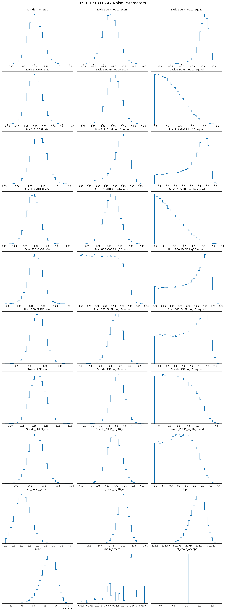
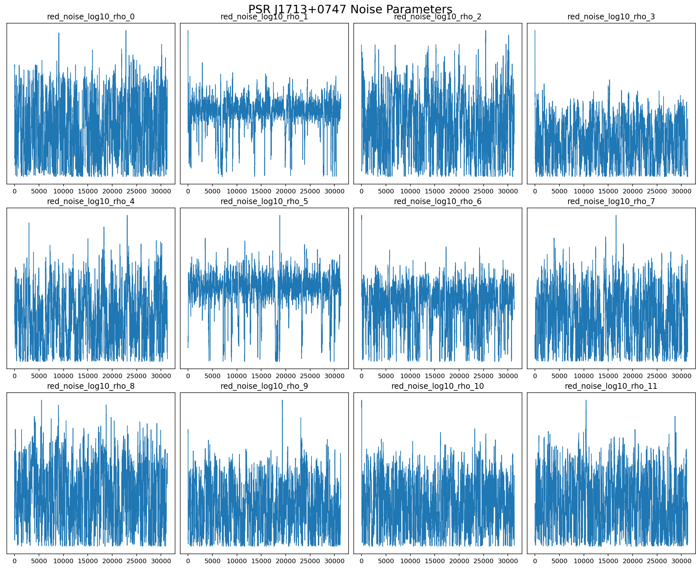
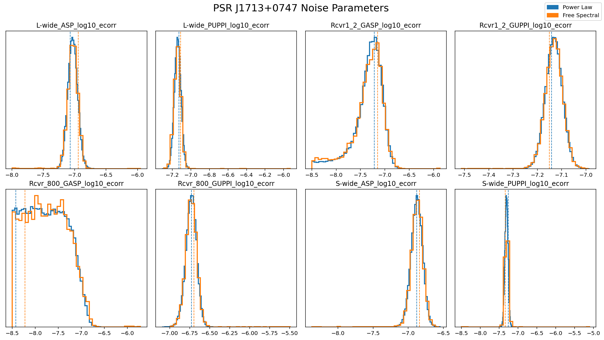

Tutorial #2 Plotting Posteriors
===============================

.. code:: ipython3

    import la_forge.core as co
    import la_forge.diagnostics as dg
    import matplotlib.pyplot as plt
    %matplotlib inline
    %config InlineBackend.figure_format = 'retina'
    import numpy as np

.. code:: ipython3

    coredir = '/Users/hazboun/software_development/la_forge/tests/data/cores/'

.. code:: ipython3

    c0 = co.Core(corepath=coredir+'J1713+0747_plaw_dmx.core',
                 label='NG12.5yr Noise Run: Power Law Red Noise')

.. parsed-literal::

    Loading data from HDF5 file....

.. code:: ipython3

    c1 = co.Core(corepath=coredir+'J1713+0747_fs_dmx.core',
                 label='NG12.5yr Noise Run: Free Spectral Red Noise')

.. parsed-literal::

    Loading data from HDF5 file....

.. code:: ipython3

    dg.plot_chains(c0)

.. code:: ipython3

    c1.set_burn(0)
    dg.plot_chains(c1,
                   hist=False,
                   pars=c1.params[24:36],
                   ncols=4)

.. code:: ipython3

    ecorr_pars = [p for p in c0.params if 'ecorr' in p]

.. code:: ipython3

    dg.plot_chains([c0,c1],
                   plot_map=True,
                   ncols=4,
                   pars=ecorr_pars,
                   title_y=1.05,
                   legend_labels=['Power Law', 'Free Spectral'],
                   linewidth=2)

