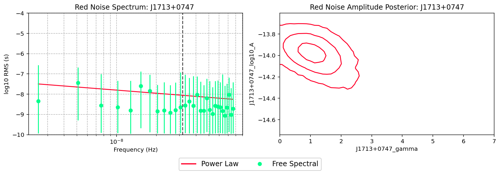
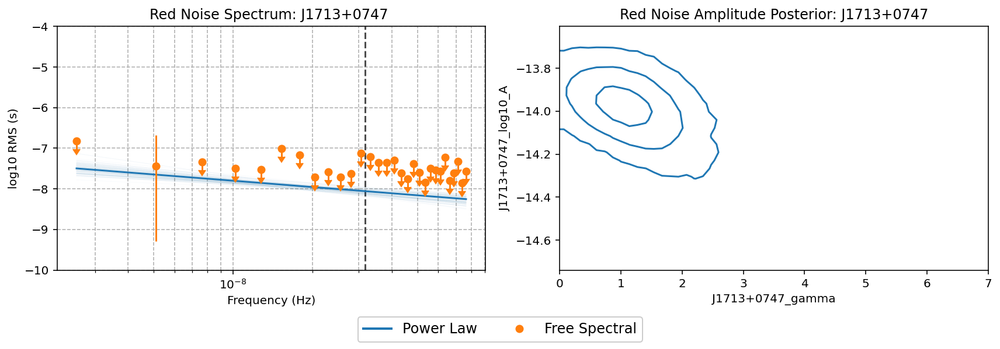
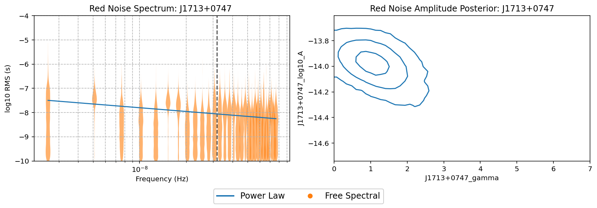

Tutorial #3 Plotting Red Noise Spectra
======================================

.. code:: ipython3

    import la_forge.core as co
    import la_forge.rednoise as rn
    import matplotlib.pyplot as plt
    %matplotlib inline
    %config InlineBackend.figure_format = 'retina'
    import numpy as np

.. code:: ipython3

    coredir = '/Users/hazboun/software_development/la_forge/tests/data/cores/'

.. code:: ipython3

    c0 = co.Core(corepath=coredir+'J1713+0747_plaw_dmx.core',
                 label='NG12.5yr Noise Run: Power Law Red Noise')

.. parsed-literal::

    Loading data from HDF5 file....

.. code:: ipython3

    c1 = co.Core(corepath=coredir+'J1713+0747_fs_dmx.core',
                 label='NG12.5yr Noise Run: Free Spectral Red Noise')

.. parsed-literal::

    Loading data from HDF5 file....

.. code:: ipython3

    rn.plot_rednoise_spectrum('J1713+0747',
                              [c0,c1],
                              rn_types=['_red_noise','_red_noise'])

.. parsed-literal::

    Plotting Powerlaw RN Params:Tspan = 12.4 yrs, 1/Tspan = 2.6e-09
    Red noise parameters: log10_A = -13.97, gamma = 1.02
    Plotting Free Spectral RN Params:Tspan = 12.4 yrs   f_min = 2.6e-09

.. code:: ipython3

    rn.plot_rednoise_spectrum('J1713+0747',
                              [c0,c1],
                              free_spec_ul=True,
                              rn_types=['_red_noise','_red_noise'],
                              Colors=['C0','C1'],
                              n_plaw_realizations=100)

.. parsed-literal::

    Plotting Powerlaw RN Params:Tspan = 12.4 yrs, 1/Tspan = 2.6e-09
    Red noise parameters: log10_A = -13.97, gamma = 1.02
    Plotting Free Spectral RN Params:Tspan = 12.4 yrs   f_min = 2.6e-09

.. code:: ipython3

    rn.plot_rednoise_spectrum('J1713+0747',
                              [c0,c1], 
                              rn_types=['_red_noise','_red_noise'],
                              free_spec_violin=True,
                              Colors=['C0','C1'])

.. parsed-literal::

    Plotting Powerlaw RN Params:Tspan = 12.4 yrs, 1/Tspan = 2.6e-09
    Red noise parameters: log10_A = -13.97, gamma = 1.02
    Plotting Free Spectral RN Params:Tspan = 12.4 yrs   f_min = 2.6e-09

